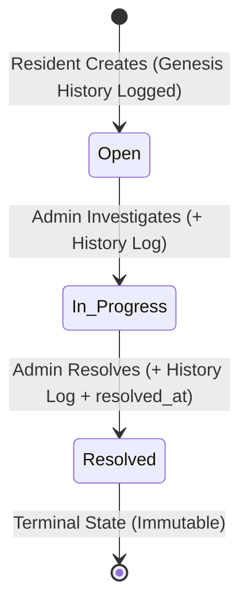
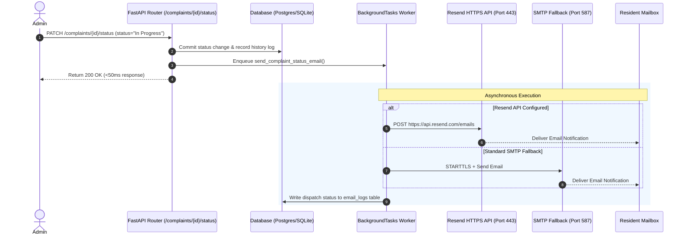

# 🏗️ SocioSphere System Design

A technical write-up detailing the core architecture of SocioSphere's complaint audit ledger, dynamic SLA/overdue detection, pluggable photo storage pipeline, and asynchronous notification engine.

---

## 1. Complaint History & Audit Trail Model

The complaint lifecycle is governed by an immutable audit ledger (`ComplaintStatusHistory`) paired with strict finite-state machine (FSM) validation:

* **Data Schema & Relationships**:
  * `Complaint` has a 1-to-many relationship with `ComplaintStatusHistory` (`cascade="all, delete-orphan"`, ordered chronologically by `changed_at`).
  * `ComplaintStatusHistory` records `complaint_id` (FK on `complaints.id`), `old_status`, `new_status`, `changed_by` (FK on `users.id`, `ondelete="SET NULL"`), admin `note`, and `changed_at` (UTC timestamp).
* **FSM Transitions & Immutability**:
  * Allowed transitions follow a strict linear progression: `Open` $\rightarrow$ `In Progress` $\rightarrow$ `Resolved`.
  * `Resolved` is terminal: any subsequent transition attempt is rejected with HTTP 400.
  * Creating a complaint automatically writes the genesis entry (`old_status=None`, `new_status=Open`, `note="Complaint raised"`), guaranteeing unbroken auditability from day zero.
* **Security & Access**: Read access is governed by RBAC (Residents view only their own complaints' audit trails; Admins view all).

---

## 2. Dynamic Overdue Detection & Triage Engine

Rather than relying on static database flags or fragile cron-only mutations, overdue status is computed dynamically at query time and runtime:

* **Configurable Runtime Threshold**:
  * Stored in the `app_settings` key-value table (`overdue_threshold_days`, default: 7 days).
  * Admins can adjust the threshold dynamically via `PATCH /admin/settings` without server restarts.
* **Evaluation Logic**:
  $$\text{is\_overdue} = (\text{status} \neq \text{Resolved}) \land (T_{\text{now\_utc}} - T_{\text{created\_at}} \ge \text{threshold\_days} \times 86400\,\text{s})$$
* **SQL-Level Triage & Ranking**:
  * Admin complaint list (`GET /admin/complaints`) utilizes an indexed multi-tier SQL `CASE` sorting expression:
    1. **Overdue Status** (`is_overdue = TRUE` ranked first),
    2. **Priority** (`High` $\rightarrow$ `Medium` $\rightarrow$ `Low`),
    3. **Recency** (`created_at DESC`).
* **KPI Aggregation**: The dashboard computes the aggregate overdue count via a single SQL query (`COUNT(id) WHERE status != 'Resolved' AND created_at <= :cutoff_timestamp`), avoiding $O(N)$ ORM loading.

---

## 3. Photo Handling & Dual Storage Pipeline

To balance local development speed with production-grade CDN scalability, media handling utilizes a unified storage abstraction layer (`app/services/storage.py`):

* **Ingestion & Validation Pipeline**:
  * **Input**: Ingested via `multipart/form-data` alongside complaint metadata.
  * **MIME & Extension Whitelist**: Restricted to `.jpg`, `.jpeg`, `.png`, `.webp` (MIME: `image/jpeg`, `image/png`, `image/webp`).
  * **Payload Limiting**: Enforces a strict 5MB file size limit before writing to disk/cloud.
* **Dual-Backend Strategy with Resilient Fallback**:
  * **Production (Cloudinary CDN)**: When `STORAGE_BACKEND=cloudinary` and credentials are valid, images are streamed directly to Cloudinary (`folder="society_complaints"`) and the CDN `secure_url` is persisted.
  * **Local / Fallback Storage**: If Cloudinary is unconfigured or encounters upstream network errors, the service automatically falls back to local storage (`/uploads/{uuid4}{ext}`), ensuring zero user transaction dropouts.

---

## 4. Asynchronous Multi-Channel Notification Flow

Email notifications keep residents informed of ticket progress without degrading API response times:

* **Non-Blocking Dispatch**: Status transitions enqueue emails into FastAPI `BackgroundTasks`, decoupling synchronous HTTP request cycles from external network latencies.
* **Resilient Dual Transport**:
  * **Primary (Resend REST API)**: Dispatches via HTTPS POST to `https://api.resend.com/emails` over port 443. This bypasses port 25/587 egress blocks common on free-tier cloud environments (e.g., Render).
  * **Secondary (Standard SMTP)**: Falls back to standard SMTP (`STARTTLS` on port 587) if Resend is unconfigured or fails.
* **Delivery Observability**: Every dispatch attempt is logged to the `email_logs` table (`to_email`, `subject`, `status="sent"|"failed"`, `related_complaint_id`, and `error_message`), providing comprehensive delivery observability and auditing.
